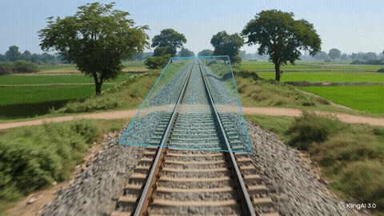

# Railway Track Obstacle Detection System

A computer-vision system that watches a railway track and flags obstacles (vehicles, people, animals, fallen objects) as **DANGER** only when they actually overlap the track — ignoring anything safely off to the side.

## Demo



Green box = object detected off the track (SAFE). Red box = object overlapping the track (DANGER), with an on-screen warning banner.

## How it works

1. **Object detection** — a pretrained YOLO model (`ultralytics`) detects objects (cars, people, animals, etc.) in each video frame.
2. **Track region (ROI)** — the track area is defined as a trapezoid (since rails converge toward the horizon due to perspective). A simple calibration tool lets you click the 4 track corners on any video to generate this region.
3. **Overlap check** — each detected bounding box is checked against the track region. If it overlaps, it's marked DANGER; otherwise SAFE.

## Setup

```bash
pip install ultralytics opencv-python numpy
```

## Usage

**Step 1 — basic object detection (sanity check):**
```bash
python step1_yolo_detection.py --source your_video.mp4
```

**Step 2 — calibrate the track region for your video:**
```bash
python step2_add_roi.py --source your_video.mp4 --calibrate
```
Click the track's 4 corners in order: top-left, top-right, bottom-right, bottom-left. Copy the printed coordinates into the `TRACK_POLYGON` variable near the top of `step2_add_roi.py`.

**Step 3 — run detection with danger/safe overlay:**
```bash
python step2_add_roi.py --source your_video.mp4
```

Optional flags:
- `--save output.mp4` — save the annotated output to a video file
- `--slow 60` — slow down the live preview window
- `--conf 0.4` — detection confidence threshold

## Files

| File | Purpose |
|---|---|
| `step1_yolo_detection.py` | Basic YOLO object detection on a video |
| `step2_add_roi.py` | Adds track ROI calibration + DANGER/SAFE overlap logic |

## Notes

- Assumes a roughly fixed camera angle (the track region is a hardcoded trapezoid, recalibrate per video/camera).
- Runs on CPU; a GPU will process frames significantly faster.

## Future improvements

- Custom-trained model for track-specific hazards (fallen trees/branches) not covered by the default COCO classes.
- Dynamic track detection (Hough line transform or segmentation) instead of a fixed calibrated trapezoid, for moving/handheld cameras.
